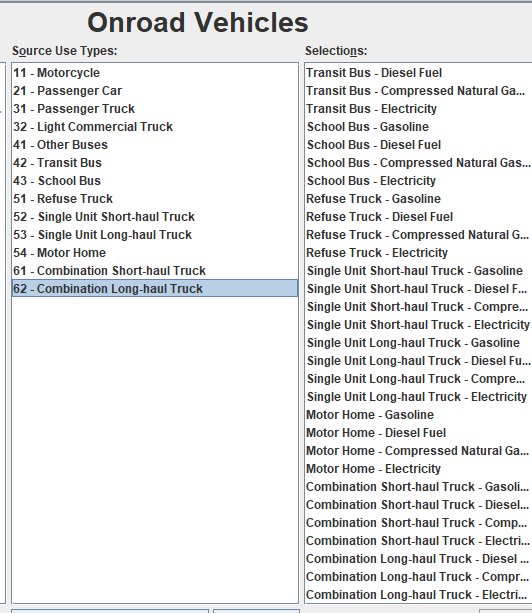

# respond to questions:
- There are existing datasets, not in the format that we want it though
    - Most are ideal looking cars, not surveillence footage
    - Surveillence footage is largely of one angle
    - Labels are limited (like car, bus, motorcycle, etc.)
    - Most related datasets are CompCarsSV and BITVehicle

Labeling our own data:
---
These categories were chosen based off of the vehicle size and fuel type that they use.
With the cars that are kind of "merged" within one group (one group is one bullet point)
it is done as at resolution, it will be difficult to differentiate between the vehicle 
shapes. Additionally, cars like sedan/couple/hatchback are all considered "light duty 
passenger vehicles". Since I'm still learning and don't know much about cars, ChatGPT 
helped me create these initial classes for cars. 

1. Passenger cars
    - (Sedan / Coupe / Hatchback) => Sedan (all three types are considered one class)
    - (SUV / Crossover) => SUV
2. Larger vehicles
    - (Van / Minivan / Passenger Van) => Van
    - Bus (city / school)
    - Pickup Truck
3. Truck
4. Two wheelers (motorcycle/scooter)
5. NYC Vehicles
    - Taxis, NYPD cars, ambulences, firetrucks 

- Found this cool model: [Segment Anything in Images and Videos](https://ai.meta.com/research/publications/sam-2-segment-anything-in-images-and-videos/)
    - Allows you to like "cut out" any object in any image with "a single click"
    - Produces high quality object masks from input prompts
    - Has strong zero-shot performance on a variety of segmentation tasks
    - Could be useful for getting car masks to label our data

Emission data
---
- [The Handbook of Emission Factors for Road Transport](https://www.hbefa.net/)
    - Seems very, very useful 
    - Provides emission factors for all current vehicle categories (PC, LDV, HGV, urban buses, coaches and motor cycles), each divided into different categories, for a wide variety of traffic situations.
    - HBEFA is a standard data source for emission calculations in numerous studies and other applications
    - Costs 50 euros for the student version
- [Bureau of Transportation](https://www.bts.gov/content/estimated-national-average-vehicle-emissions-rates-vehicle-vehicle-type-using-gasoline-and)
    - Table aggregated into light duty vehicles, trucks, buses, heavy duty vehicles, motorcycles
    - Source above might be more helpful as it has data per setting (ex. emissions related to urban settings)
    - Data since Jan. 15, 2025, estimates are by calendar year
    - Factors are averages based on national averages on everything (gasoline fuel properties, vehicle speeds, temperature, etc.)
    - Good if there is nothing else
- [MOtor Vehicle Emission Simulator (MOVES](https://www.epa.gov/moves/latest-version-motor-vehicle-emission-simulator-moves)
    - Simulation system for modeling emissions
    - Has a way of grouping vechicles by class based on Federal Highway Administration (FHWA) VM-1
    - Light duty vehicles have a gross vehicle weight rating (GVWR) less than 8,500 lbs
    - Heavy duty vehicles have a GVWR >= 8,500
    - It is difficult to determine whether a vehicle is a passenger car, light duty truck or heavy duty truck just based on the make/model description.
    - "Typically, EPA uses contractors to compile EPA certification records, decode vehicle identification number (VIN) and contact manufacturers to identify the appropriate classification for individual vehicles and rely on national sales data provided by manufacturers to develop nationwide fleet mixes"
    - Playing around with the simulator, could be interesting looking into how they aggregate their cars by groups
    - 
