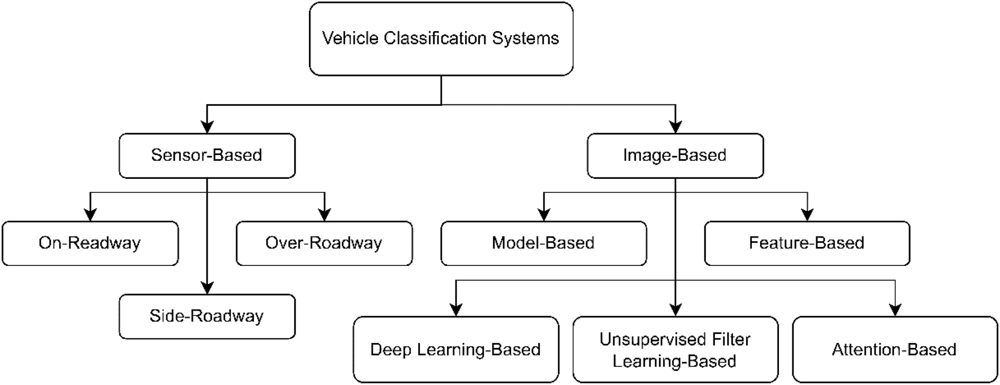

# more updates

- API get camera data doesn't return all of the cameras
    - Only returns cameras owned by Skyline & NYSDOT
    - Can potentially use other method of saving images through screenshots to obtain these images
- Collected 840 images from 3:30pm-5:30pm yesterday in four boroughs

- Come up with classes of cars
    - [https://www.theengineeringchoice.com/types-of-cars/](https://www.theengineeringchoice.com/types-of-cars/)
    1. `suv`
    2. `crossover`
    3. `sedan`
    4. `pickup_truck`
    5. `hatchback`
    6. `convertible`
    7. `luxury`
    8. `coupe`
    9. `hybrid_electric`
    10. `minivan`
    11. `sport`
    12. `station_wagon`

- Sub Categories
    - Full size
    - Compact
    - Mid size
    - Small

- Dataset options for cars:
    - Stanford Car Dataset (2013): [https://www.kaggle.com/datasets/eduardo4jesus/stanford-cars-dataset/data](https://www.kaggle.com/datasets/eduardo4jesus/stanford-cars-dataset/data)
        - 16,185 images of 196 classes of cars
        - Only includes cars from up to 2013
    - Car Models 3778 [https://www.kaggle.com/datasets/eimadevyni/car-model-variants-and-images-dataset](https://www.kaggle.com/datasets/eimadevyni/car-model-variants-and-images-dataset)
        - Around 193k images across 3778 car model variants
        - Obtained through web scraping autoevolution.com
        - Includes make, model, year, body type, engine type, transmission, and fuel type, among other specifications
        - Both interior and exterior of cars
        - Cars look very ideal, as in like commercial-like perfect
    - CompCars (2015) [https://www.kaggle.com/datasets/renancostaalencar/compcars](https://www.kaggle.com/datasets/renancostaalencar/compcars)
        - 136,726 images capturing the entire cars with 1,716 models
        - Full car images are labeled with bounding boxes and viewpoints
        - Car model is labeled with five attributes, including maximum speed, displacement, number of doors, number of seats, and type of car
        - Has dataset of surveillence footage (44,762 cars, 281 classes)
        - All kinda seem like they're front facing views
        - Chinese cars though
    - BITVehicle (2015) [https://www.kaggle.com/datasets/kuanghangdong/bitvehicle](https://www.kaggle.com/datasets/kuanghangdong/bitvehicle)
        - Roughly 10,000 cars
        - Is the environment we're looking for! Vehicles on the road
        - Labeled with vehicle type (SUV, Sedan, Microbus, Bus, Truck)
    - BoxCars (2016) [https://www.kaggle.com/datasets/igorlashkov/boxcars-dataset](https://www.kaggle.com/datasets/igorlashkov/boxcars-dataset)
        - 116,000 cars and resulting "box" on where the car is in the image
        - Images are of similar quality as to what we have
        - There are no labels relating to the type of car.
        - "The dataset contains tracked vehicles with the same label and multiple images per track."
        - Looks like it's just the same car being tracked down the road

Existing literature
---
- Survey on AI systems for vehicle classification: [https://www.sciencedirect.com/science/article/pii/S0952197623016810](https://www.sciencedirect.com/science/article/pii/S0952197623016810)
    - VTR = vehicle type recognition
        - Challenge is that there are large intraclass differences
        - Ex. sedans from different manufacturers are "far from similar" from the exterior
    - VLR = vehicle logo recognition
        - Challenge is that logo is very small compared to overall size
    - VMMR = vehicle make and model recognition
        - Challenge is that it is "plagued by multiplicity and ambiguity"
        - Multiplicity = appearence of a model is similar across different released year
        - Ambiguity = Vehicles with different makes have minimal exterior differences
- 
- Introduced a lot of public datasets used for these tasks
- Used accuracy, precision, recall, f1, AOC, and average precision as evaluation metrics.
- They also introduce sensor-based classification but that doesn't seem to be what we want to do here.
- Imaged based methods
    - Early work was classification based on vehicle shapes and forming a 3D box around the vehicle
    - Then moved onto feature based methods (generate local features and interest points) to get something like edge information from vehicle front and then classification based off cosine or euclidian distance
    - Uses HOG (histogram-based orientation gradients) to express image feautres
    - [https://ieeexplore.ieee.org/stamp/stamp.jsp?tp=&arnumber=8055602](https://ieeexplore.ieee.org/stamp/stamp.jsp?tp=&arnumber=8055602)
        - Classifiers seem to be some sort of gradient boosted tree
        - 97.5% accuracy on CompCars surveillence dataset
        - HOG does not consider spatial property of image patch so features are not discriminative enough
    - Survey has this nice table with all notable previous works, features they used, and accuracy achieved
- Interest point-based methods
    - Identify prominent points of image that have high explanatory power
    - SIFT features are more robust against scaling and rotation (eventually V-SIFT)
    - SURF features are faster than SIFT with up to par accuracy
    - Table 5 has a summary of interest point-based methods.
- Feature encoding-based methods
    - Used to represent the local features at global level
    - Bag of Features, fisher vector, and locality-contstraint linear coding are examples of encoding schemes
        - BOF = uses clustering algorithms to identify the visual words during training
        - Local features are mapped to nearest visual words to build histogram of visual words which serves as an input to the model
    - Table 6 has a summary of feature encoding-based methods.
- Deep learning-based methods
    - Eliminates having to handcraft features by learning them automatically
    - CNNs have been strong in this field of classification through images
        - AlexNet = First best performing CNN with 5 conv layers and 3 fully-connected layers. 94.1% accuracy on CompCarsSV
        - Overfeat = performs convolutions at multiple resolutions to increase robustness gainst scaling. 98.3% on CompCarsSV
        - GoogLeNet = Uses 3 different kernel sizes and countered vanishing gradient
        - Skip connections and compress scaling were used to perform VTR which reported 95.1% accuracy for 7 vehicle models
        - DarkNet19 and DarkNet53 to suit VLR: Used multiple 3x3 and 1x1 conv kernels to extract fine features: 81.4% accuracy
        - SqueezeNet = 2 conv layers and 8 fire modules (performs squeezing and expanding using 1x1 and 3x3 convolution to learn deep features with minimal params): 96.3% accuracy on dataset with 766 models
        - Different classifier other than softmax can increase performance like svms (finding regions in hyperplanes)
        - DWT pooling seems to perform better over max pooling, avg pooling, etc.
        - Faster R–CNN performs well when object of interest is dynamic, partially occluded and under low lighting condition
        - YOLO models = One stage object detection, modern versions are suited to detect tiny objects which performed well on VLR
        - Table 7 has a summary of deep learning-based methods.
- Unsupervised filter learning-based methods
    - CNNs described previously have their convolutional kernel weights learnt via supervised method
    - Some methods investiaged learning conv filters using unsupervised approaches
    - Refers to a training process that optimizes the convolutional kernel weights without using the label information.
        - Filters and classifiers are trained independently
        - Results in shorter model training time and supposedly better classification performance
    - 2015 study proposed a semi-supervised CNN for VTR
        - The proposed framework fails mostly on differentiating between SUV and sedan which share similar appearance
    - CNN holds onto principles of local connectivity and parameter sharing
        - LTCNN = input feature map is divided into sub-regions and parameter sharing strategy only applies to feature responsed located within the same sub-region
        - PCA-CNN = learns conv filters using few principal components to seek variance maximization among image patches
            - Intention was to initialize the convolutional kernel weights with PCA filters to allow faster convergence during training
            - Turned out to be redundant as filters were not good enough to be used directly without further fine-tuning
            - Their framework is more accurate and faster to train
    - table 8 has a summary of unsupervised filter learning-based methods.
- Attention based methods

